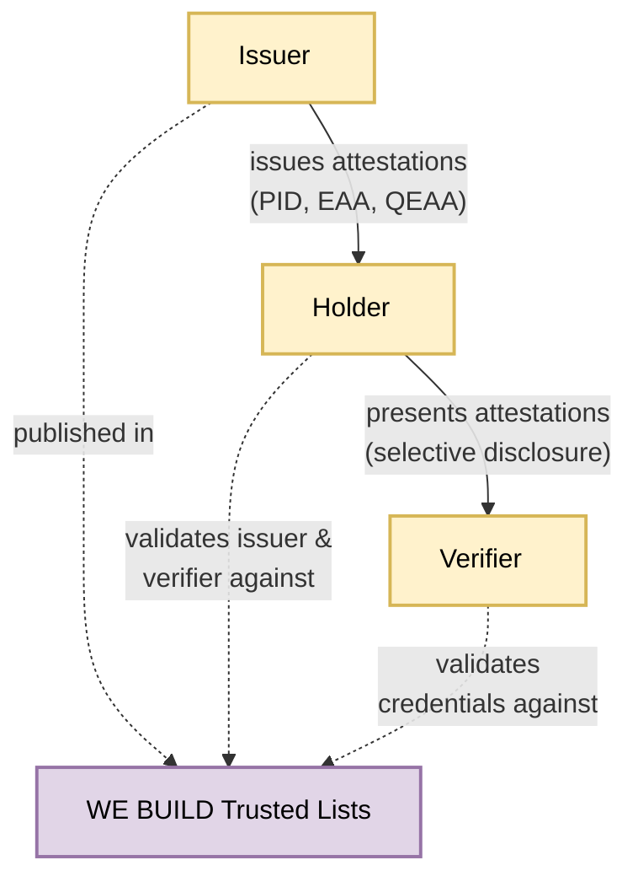
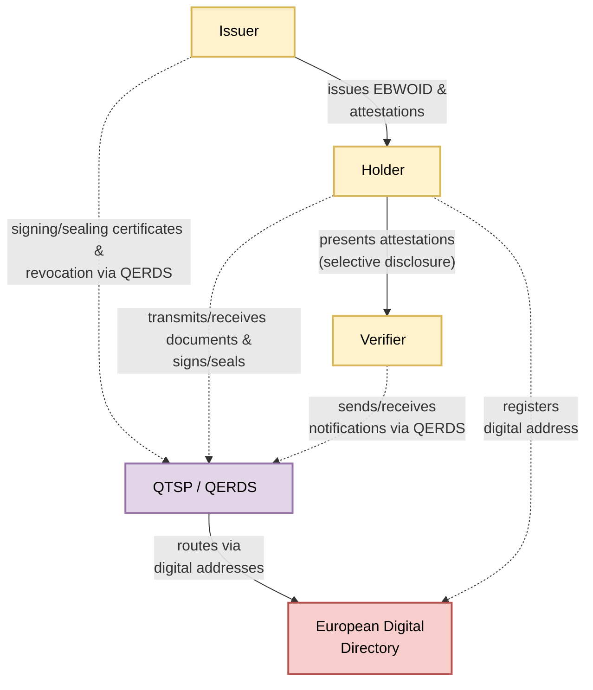

# Architecture Overview

## Architectural Principles
While the previous chapter describes the regulatory and architectural frameworks that WE BUILD aligns with, this chapter introduces the architectural principles guiding the design of the WE BUILD ecosystem.

- **Interoperability:** Wallet providers, issuers and verifiers can interact across organisational and national boundaries.
- **Reusability:** Building on existing EU digital infrastructure and results from previous Large Scale Pilots.
- **Security by design:** Security controls are integrated into the architecture from the beginning.
- **Privacy by design:** Users retain control over personal and organisational data through selective disclosure and explicit consent.
  
## The Ecosystem at a Glance
The EUDI Wallet and EBW ecosystem follows the common three-party attestation model. In this model, three primary actors interact: issuer, holder and verifier. A trust framework supports these actors by providing the trust anchors used for validation.
1. **Holder** – the wallet controlled by a natural or legal person.
2. **Issuer** – an entity that issues attestations to the Holder.
3. **Verifier** – a relying party that receives and validates attestations presented by the Holder.
4. **Trust framework** – the infrastructure used to validate trust relationships between ecosystem participants.

## System Landscape
The diagram below illustrates the baseline trust topology of the EU wallet ecosystem. Issuers provide attestations to holders, holders present them to verifiers, and all actors validate trust relationships using the trusted lists.

In the WE BUILD project, the focus is primarily on wallets for legal entities. 
In these scenarios, qualified electronic registered delivery services (QERDS) support trusted messaging between participants. 
Accordingly, interactions between issuers, holders and verifiers may be routed through a Qualified Trust Service Provider (QTSP) operating a QERDS. 
The European Digital Directory provides digital addressing for secure routing of documents and notifications.

The diagram changes to this:

