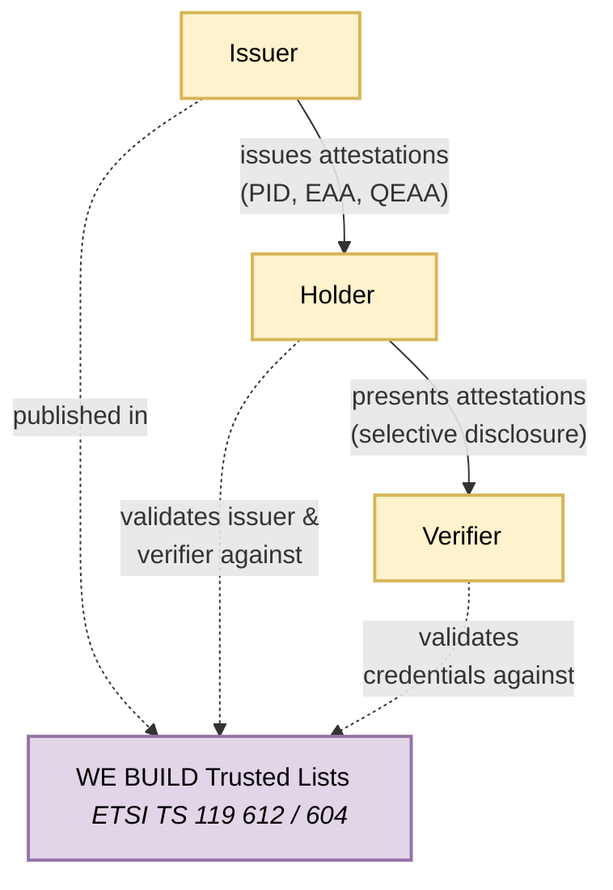
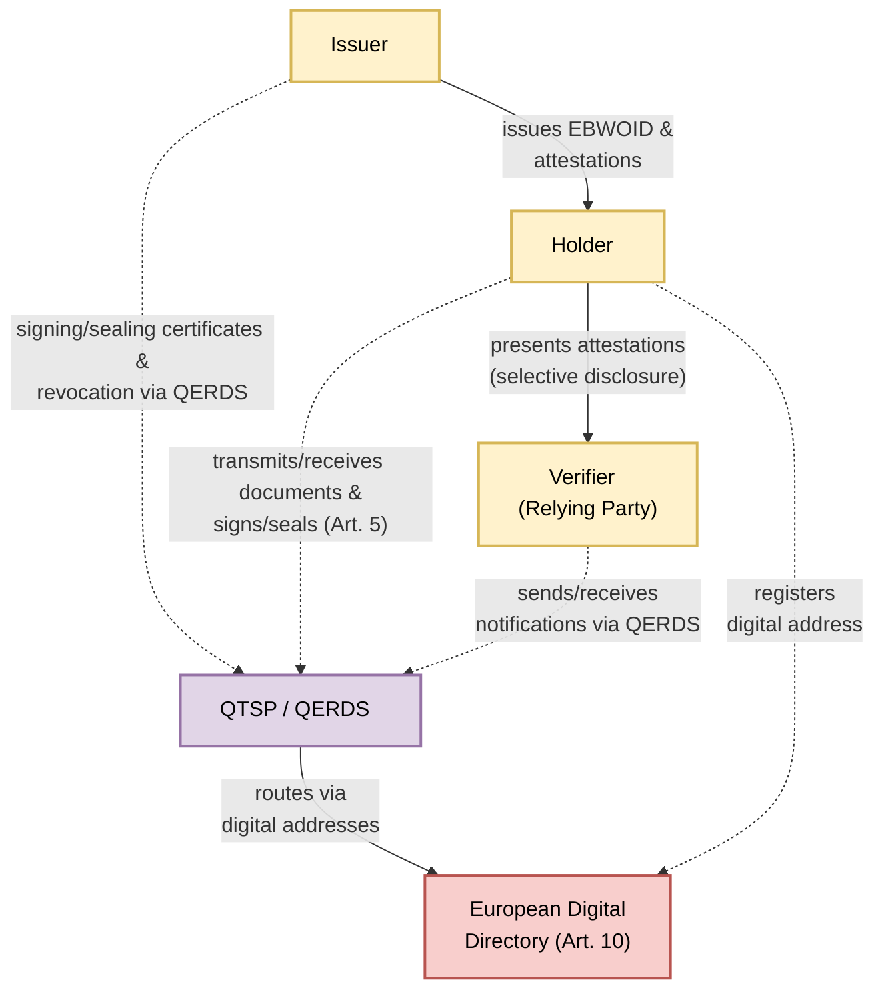

# Architecture Overview

## The Ecosystem at a Glance
The EU digital identity and EU business wallet ecosystem is an instance of the 3 party model for attestations. In this model there are 4 main actors:

1. The holder, aka the identity wallet that is controlled by either a natural or legal person
2. The issuer that relies on authentic sources of information to issue attestations to the holder/wallet
3. The verifier receives an attestation based on information present in the wallet.
4. The trust framework that in the EU ecosystems is based on ETSI TS 119604/119612 aka trust status lists populated by trust status providers that for some use cases are QTSPs

The EU ecosystem for the natural person wallet is described in more detail in [ARF]. The corresponding document for the EU legal person wallet is in progress.

Several sources exist for describing the more general 3rd-party model, including ongoing work in the IETF eg [https://datatracker.ietf.org/doc/draft-ietf-spice-vdcarch/]

## System Landscape

The diagram below illustrates the baseline trust topology of the EU wallet ecosystem. Issuers provide attestations to holders, holders present them to verifiers, and all parties anchor trust decisions against the EU trusted lists defined under ETSI TS 119 612 and ETSI TS 119 604 within the framework of the eIDAS Regulation.

---

In the WE BUILD project the focus is primarily on wallets for legal entities. In this case the regulation includes the use of qualified electronic registered delivery services to enable messaging services between entities in the ecosystem. Accordingly, the generic trust anchor is replaced by a Qualified Trust Service Provider operating a Qualified Electronic Registered Delivery Service (QTSP/QERDS), through which issuers, holders, and verifiers route their trust and messaging interactions. The European Digital Directory provides digital addressing for secure routing of documents and notifications. The diagram changes to this:

## Wallet Types in WE BUILD 

WE BUILD supports wallet solutions for both natural persons and economic operators.

Natural persons interact through EUDI Wallets, which enable individuals to authenticate and present personal identity attributes. Economic operators interact through EBW, which enable organisations to manage and present business-related attestations such as representation rights or organisational attributes.

From a deployment perspective, wallet solutions can be implemented in several ways depending on the target users, operational requirements, and cryptographic architecture. In practice, three main implementation approaches are relevant within the WE BUILD ecosystem.

| Wallet type | Typical context | Characteristics |
|---|---|---|
| **Mobile wallets (on-device)** | Natural persons | Wallet application running on a user’s smartphone, with credentials stored and used locally on the device. |
| **Server or Web-based wallets** | Economic operators | Wallet services operated in backend infrastructure and accessed through Web interfaces or enterprise systems. |
| **Hybrid wallets** | Both contexts | Combine device-based interaction with backend cryptographic infrastructure. |

The underlying cryptographic architecture of wallets is defined in the ARF and related standards. This Blueprint therefore focuses on the interactions and interoperability patterns relevant for WE BUILD rather than repeating the detailed wallet architecture definitions.

In practice, most deployments follow a mobile-first approach for natural persons and a server-based or enterprise-integrated approach for economic operators. Hybrid architectures may also be used to combine device-based user interaction with backend cryptographic services.
