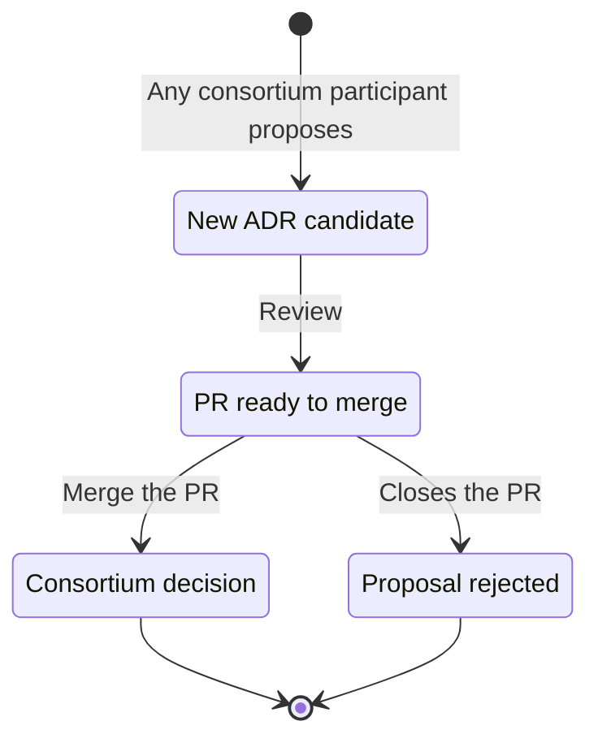
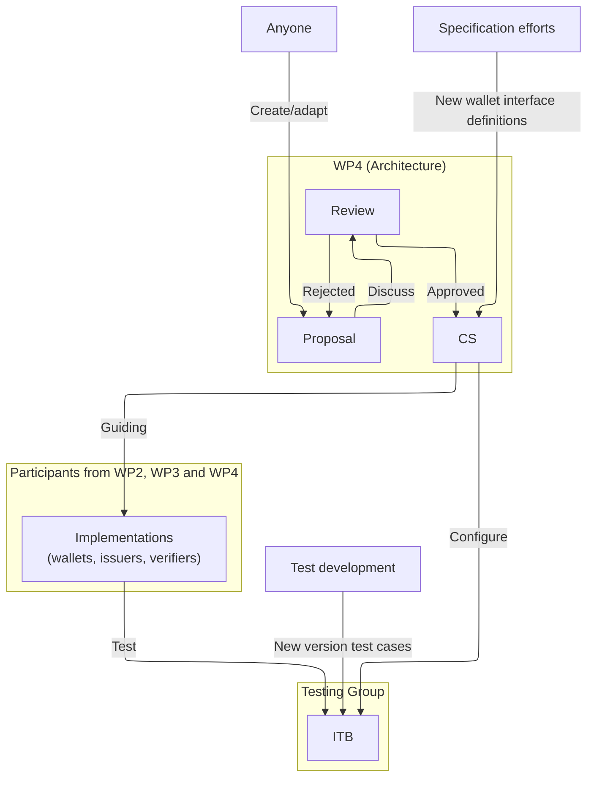

# Architecture Governance: ADRs and WBCS
While the previous chapter described the operational trust infrastructure, this chapter describes the governance model used to define and maintain the technical architecture of the WE BUILD ecosystem. In a project as large as WE BUILD, interoperability between independently developed components must be ensured without requiring every developer to participate in all coordination meetings.

To maintain alignment, the project uses a technical governance model based on consensus, commitment and clear documentation. Technical choices are driven by the needs of the 13 use cases implemented in the project.

## Architectural Decision Records (ADR)
[The ADRs](https://github.com/webuild-consortium/wp4-architecture/tree/main/adr) is essentially our project’s "logbook" for major decisions.
- Purpose: The ADR process is where we formally capture and justify significant technical choices, such as which specific protocols and formats to use. Instead of having these decisions buried in a slide deck or a long email chain, we document the rationale and context so that everyone can understand the "Why" behind a choice.
- Classification: We maintain a lightweight ADR for any software-related decision that affects how different systems work together (interoperability). This ensures alignment with external rules like the eIDAS Regulation and the ARF.
- Lifecycle: ADRs are managed on GitHub ([webuild-consortium/wp4-architecture](https://github.com/webuild-consortium/wp4-architecture/)). They move from a "Proposed" state to "Accepted" once the Architecture Group and relevant stakeholders reach consensus.

## WE BUILD Conformance Specifications (WBCS)
If ADRs capture the rationale ("why"), the [WBCS](https://github.com/webuild-consortium/wp4-architecture/tree/main/conformance-specs) define the implementation requirements ("how").
- Operationalising Intent: We use the WBCS to turn high-level architectural goals into detailed technical rules. These specifications define the exact interfaces for wallets, issuers, and verifiers.
- A Commitment to Implement: This is the most important part: An approved WBCS is **not just a suggestion**. When a specification is approved, it signifies a commitment from the participating organizations to actually build that interface into their services.
- Defining Implementation Requirements: Because the WBCS define how interfaces and protocols must be implemented, they allow us to achieve interoperability across the whole consortium. If you follow the WBCS, you avoid building an "interoperable island" where your service only works with a few specific partners.
- The Link to Testing: Our Interoperability Testbed (ITB) uses these specifications as its primary rulebook. Implementations that do not follow the WBCS will not pass the ITB tests and are therefore not eligible for pilot participation.

## Document Lifecycle
WE BUILD moves fast, and our documentation needs to keep up. We don't wait for "perfect" documents; we iterate as the use cases mature.
- The Blueprint as a Living Framework: This Blueprint (D4.1) sets the high-level structure, but it is supported by the more agile ADRs and WBCS that live on GitHub. As we learn, we update these records and specifications.
- The Hybrid Working Flow: To keep things moving, we use a "hybrid" approach to our document lifecycle:
    - GitHub: This is our source of truth for all accepted specifications and decision records.
    - Slack: The ITB uses a dedicated channel for implementation support, where developers can ask questions and help each other in real-time.
    - Meetings: We hold interface-alignment meetings to discuss progress, resolve gaps, and gain final agreement on new specifications.
- Maturing Together: As the project moves forward, we will add more detailed definitions to the documentation stack. This approach allows the Blueprint to evolve from a high-level architectural reference into a practical guide for implementing the WE BUILD ecosystem.
