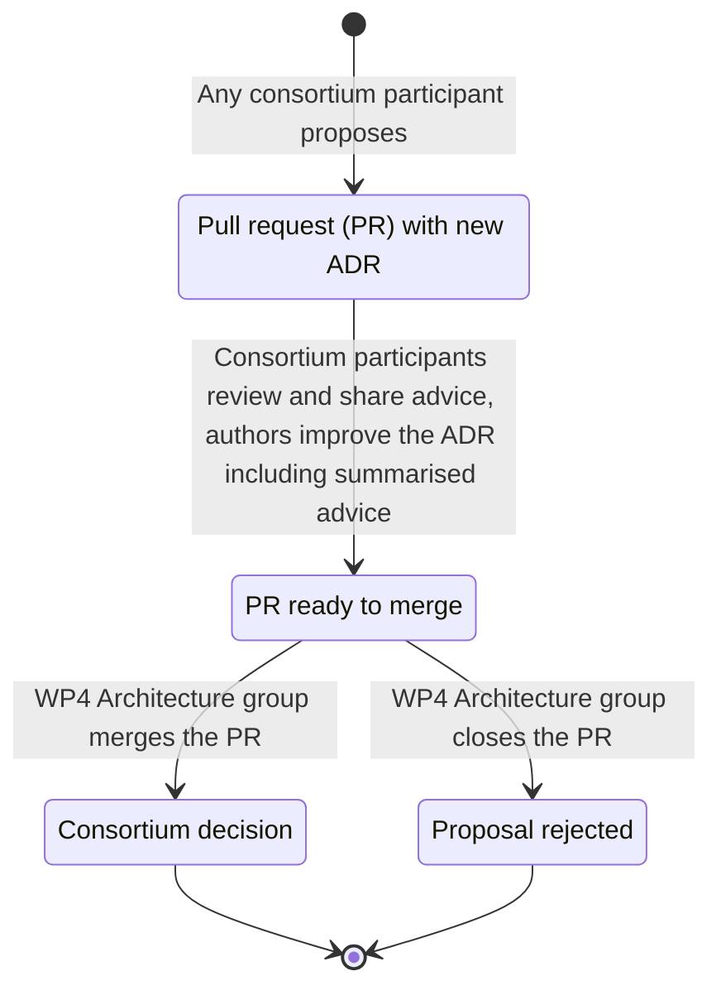

# Appendix F. Architecture decision records

[WE BUILD](https://www.webuildconsortium.eu/) maintains a lightweight architecture decision record (ADR) for each software-related decision affecting interoperability.

Propose new ADRs using the [template](_template.md). Announce them to the [Architecture group](https://portal.webuildconsortium.eu/group/architecture) in the Portal to get feedback to understand the consortium’s opinion. 

## ADR process for WE BUILD

## ADR overview

