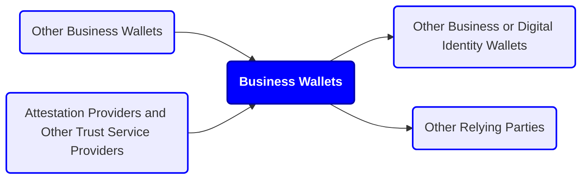

# Appendix D. Business Wallet Definition

Revision 1.0

## Scope and context 

This document sets out a non-technical working definition of “business wallet” as introduced in the European Business Wallet regulatory proposal, to support a common interpretation within WE BUILD and in dialogue with the European Commission. It is intended as reference material for the WE BUILD use case and capability work. It does not cover detailed architecture, protocol choices, implementation design, or use case roadmaps.

This document draws on the EUDI Wallet regulations, EWC deliverables[\[1\]](#footnote-0), and relevant industry and consortium publications, and incorporates the draft Implementing Act on Business Wallet.

## Core concepts

### Description

A **Business Wallet** is a product and service that enables an organisation to identify itself, manage authorisations, exchange verified attributes and documents, and receive legally relevant notifications in support of administrative and regulatory procedures. Unlike European Digital Identity Wallets, an European Business Wallet does not need to be an eID means under an eID scheme, although it may reuse similar components.

**_WE BUILD implementation note:_** _The topic of online business identity, potentially outside of eID schemes, needs to be further discussed within the WP4 Architecture group. It may also have consequences for the WP4 PID/LPID Providers group._

A technical decomposition (front end, back end, and cryptographic components) is out of scope for this document.

Each Business Wallet has a single **wallet owner**, which is the entity that the wallet represents through its interactions. Note that this is distinct from, for example, the company owner or the wallet provider.

The wallet owner is defined by **European Business Wallet Owner Identification Data (EBW-OID)**, which includes an official name and an EU-unique identifier. These owner identification data are issued into the business wallet as an electronic attestation of attributes.

A Business Wallet can have multiple **wallet users**, meaning natural or legal persons that operate the wallet through a user interface or an application programming interface under roles and mandates set by the wallet owner. These wallet users may apply software applications to access these interfaces. Some users may be **authorised representatives**, while others may be employees or service providers operating within delegated permissions.

### Conceptual model

## Business Wallet definition

### Roles supported

A business wallet enables its owner, amongst other operations, to act as:

- Issuer, holder or verifier of electronic attestations of attributes
- Signatory or origin of sealed data
- Sender or recipient of messages, such as submissions and notifications

These operations are under role-based access control, where recognised roles comprise:

- Wallet owner: the entity that is accountable for the legal consequences of the operation
- Authorised representative: a wallet user with an administrative mandate to act on behalf of the wallet owner, potentially with a limited scope or in limited contexts

In addition, the wallet owner may configure other roles that suit the owner’s policies and/or national or EU law.

Other relevant roles are:

- Wallet provider: the entity that provides the business wallet solution to its owner (potentially the owner themselves)
- Owner identification data provider: the entity that verifies the identity of an authorised representative enrolling the wallet owner and attests, using an electronic attestation of attributes, the wallet owner's identification data in accordance with authentic source registrations

### Key functions

#### Wallet lifecycle management

The business wallet enrols its owner via the electronic identification of an authorised representative and facilitates enrolment in connected trust services and directory services. The wallet provider is responsible for attesting to its validity to relying parties and enabling authorised representatives to revoke the business wallet and perform other lifecycle changes. In several cases, the wallet provider is also responsible for notifying authorised representatives and government authorities about lifecycle changes.

**_WE BUILD implementation note:_** _This will be the responsibility of the WP4 Wallet Providers group. At least several providers will be ready to manage their wallet solution and issue wallet units under new and changing business wallet requirements._

#### Digital document management

The business wallet enables the wallet owner to create, store, use and validate various types of digital documents:

- Electronic attestations of attributes (EAAs, including QEAA, PuB-EAA, and EAA issued by the Commission)
- Business documents, such as electronic invoices
- Qualified certificates for electronic signatures and seals
- Qualified electronic signatures, seals and timestamps
- Evidence, such as provided by trust service providers upon electronic transactions, or by public sector bodies over the single digital gateway

For this purpose, the business wallet implements several applications, including signature creation and secure cryptographic applications.

**_WE BUILD implementation note:_** _The WP4 Wallet Providers provide, as part of their business wallet solutions, a subset of the functionalities required by the use cases. For the functionalities that require qualified trust services, such as the issuance of qualified certificates or the sealing of documents with qualified electronic seals, the WP4 QTSP group provides these services within WE BUILD._

#### Secure communication channel

To enable public and private sector information exchange, such as in B2G eGovernment notifications, B2B/B2G eProcurement business documents and other business use cases, a business wallet implements a secure communication channel with other business wallets, with users of digital identity wallets, or with alternative solutions provided through a gateway. This channel enables cross-border delivery and receipt of submissions and notifications with legal effect, and provides a trusted channel with public authorities and other regulated parties across the EU. The channel is implemented using a qualified electronic registered delivery service (QERDS). The digital address for the channel is registered in a standard digital directory.

**_WE BUILD implementation note:_** _the WP4 QTSP group will explore delivering an interoperable pre-production QERDS, along with CIR (EU) 2025/1944 requirements, as a service to the WP4 Wallet Providers group, working with the WP4 Architecture group on cross-cutting concerns, such as interoperability specifications. This enables wallet providers to provide a business wallet to the use cases with a digital address and access to the designated QERDS. To ensure this work is useful for the European Business Wallet regulation, WP4 would like to have an introductory meeting with DG CNECT on this subject._

#### Access control mechanism

To enable wallet owners, authorised representatives and other authorised users to access the business wallet while preventing unauthorised access, each business wallet implements role-based access control for the assets it protects, including digital documents and the secure communication channel. To identify, authenticate, and authorise wallet users, the access control mechanism relies on electronic identification means, such as digital identity wallets, and, potentially, on trust services for the electronic attestation of attributes.

**_WE BUILD implementation note:_** _The WP4 Architecture group, in collaboration with the WP4 Wallet Providers group, will explore the access-control mechanism for business-wallet solutions. This may rely on the EUDI wallets within WE BUILD or on other electronic identification means._

#### Digital transaction management

Business wallets keep logs and provide dashboard user interfaces to enable control over transactions, including operations on the wallet lifecycle and on digital documents and messages sent and received over the secure communication channel. In addition, these logs enable dispute resolution regarding potentially unauthorised transactions, failures to meet reporting obligations, or administrative or procedural activities.
